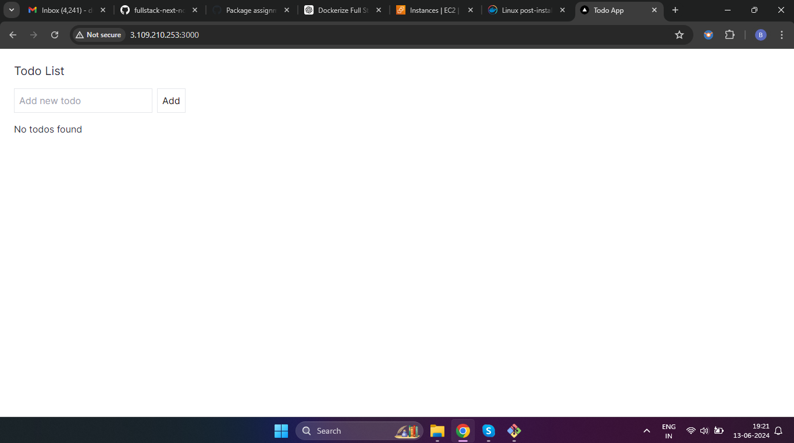
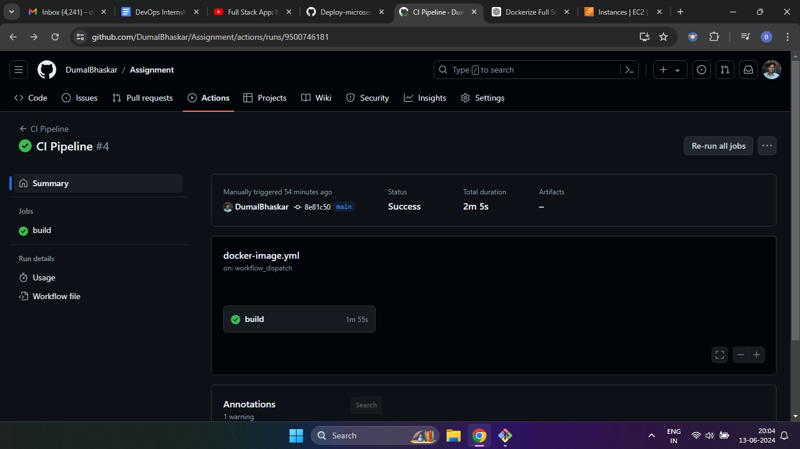

# DevOps Internship Assignment - Samagra

* Author: Bhaskar Dumal
* Date: 13 June, 2024
* Email: dumalbhaskar@gmail.com

TOOLS USED: Docker, Docker-compose, Github, Github Actions and Packages.

## NOTE: 
Hi there, hereby i have successfully completed the assignment and dockerfiles, docker-compose file and github actions pipeline file are attached to this repository.

## Application Output

## CI Pipeline

